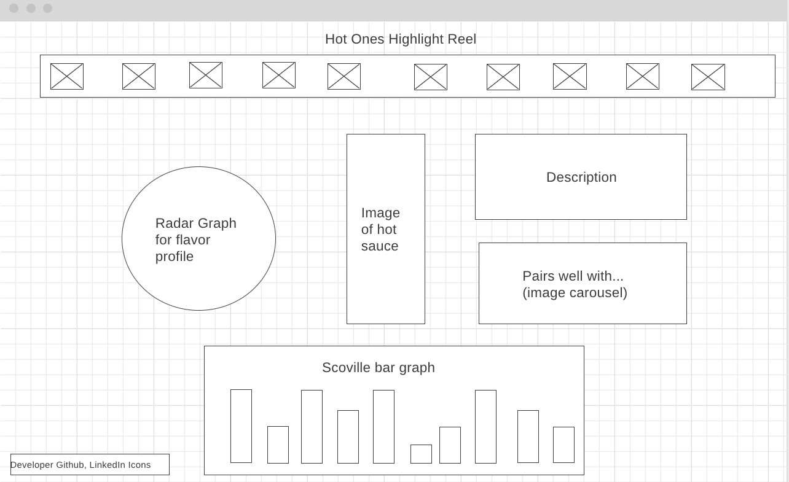

# Hot Ones Highlight Reel

## Background

This project is a data visualization project that compares a variety of hot sauces featured on the Youtube show "Hot Ones". The landing page will be modal describing th3 project and explaining how it works. The page will show all 10 hot sauce icons at the top of the page and a bar graph at the bottom comparing the scoville units for each hot sauce. The user can click on a hot sauce and it will show a radar graph of the taste profile of each sauce, a full-size image of the bottle, a description of the sauce, and an image carousel of what it pairs well with.

## Functionality and MVPs

### In this project, users will be able to:

* Select hot sauces and view their taste profiles in a dynamic radar graph
* View a bar chart comparison for all scovilles of the hot sauces
* Click through an image carousel to see what each sauce pairs well with

### In addition, this project will include:

* An About modal describing the project and how to use it.
* A production README

## Wireframe

* Hot sauces will line the top of the page in a row.
* The scoville bar graph will remain fixed to the bottom of the page
* When a user clicks on a hot sauce, the radar graph will change based on that sauce's taste profile
* The center will be a larger image of the hot sauce
* On the right will be a short description as well as a mini image carousel for what the sauce pairs well with
* In the bottom left will be the developer's Github and LinkedIn icons

## Technologies, Libraries, APIs

This project will be implemented with the following technologies:

* HTML, CSS, Vanilla JavaScript
* Webpack and Babel to bundle and transpile the source JavaScript code
* npm to manage project dependencies

## Implementation Timeline

* **Friday afternoon and weekend**: Setup the project and get webpack running. Create the HTML Layout and add basic CSS styles to position and structure the elements.

* **Monday**: Seed the data for 10 different featured hot sauces. Display them in a row at the top of the page. Implement click events on each hot sauce image to handle selection.

* **Tuesday**: Create the radar graph component using Chart.js. Create the taste profiles for each hot sauce and update the radar graph when a hot sauce is selected. Change the image in the center to the selected hot sauce. Add a section on the right to display the description and create an image carousel for the pairings.

* **Wednesday**: Create the scoville bar graph at the bottom of the page using Chart.Js. Render the icons for Github and LinkedIn. Finish styling the project.

* **Thursday morning**: Deploy to GitHub.

## Bonus features

* Change the color scheme of the page based on the hot sauce's dominant color pulled from Color Thief API